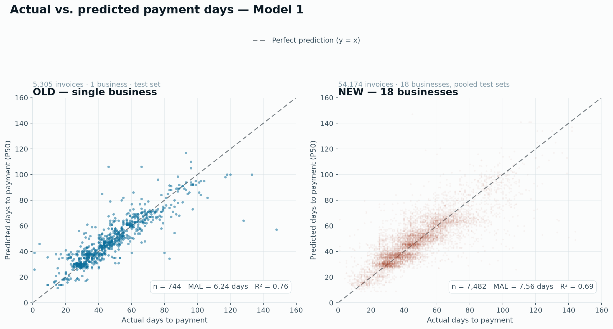
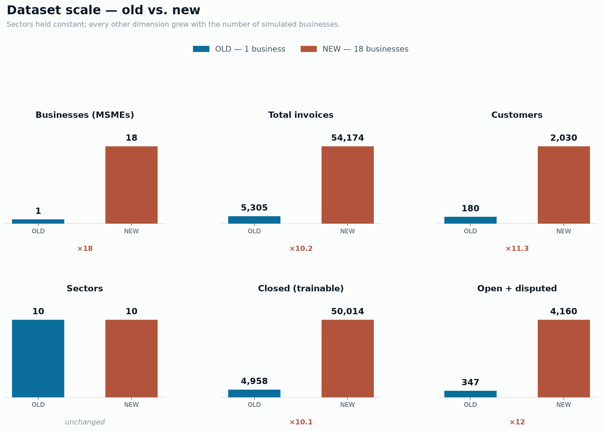
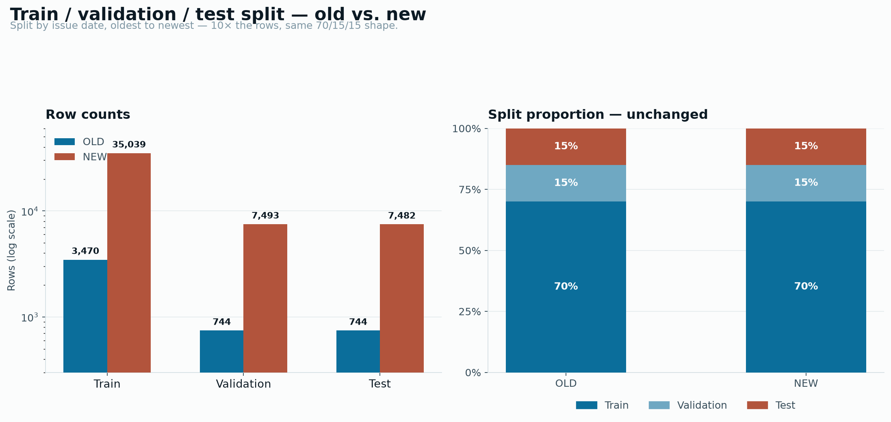

# CashTwin — MSME Cash-Flow Digital Twin

A cash-flow forecasting and decision-support tool for Indian MSMEs. Built for
the Smart India Hackathon.

The premise: an MSME's biggest cash problem is not that it lacks money, it is
that its customers pay late and it finds out too late to do anything about it.
CashTwin predicts when each invoice will actually be paid (not when the invoice
says it will), projects the resulting cash position forward, explains where the
risk comes from, and ranks what to do about it — cheapest and least-committal
first, financing last.

It is explicitly **decision support, not a lender**. It never initiates,
approves, or brokers financing.

**Live demo:** <https://msme-cash-flow-digital-twin.vercel.app/>

> The live deployment is the frontend only. Some data-dependent screens need
> the model server and gateway described in [Running it](#running-it) to show
> real numbers — see [Troubleshooting](#troubleshooting) if a section looks
> empty.

---

## Contents

- [Features](#features)
- [How it works](#how-it-works)
- [Running it](#running-it)
- [Troubleshooting](#troubleshooting)
- [Architecture](#architecture)
- [Model validation](#model-validation)
- [What each screen does](#what-each-screen-does)
- [The MSMED Act layer](#the-msmed-act-layer)
- [Design decisions worth knowing](#design-decisions-worth-knowing)
- [Known limitations](#known-limitations)
- [How this compares to existing tools](#how-this-compares-to-existing-tools)

---

## Features

- Quantile payment-date prediction (p10 / p50 / p90) per invoice, per business
- Monte Carlo cash-flow forecasting with optimistic / expected / pessimistic bands
- Anomaly detection over invoice and payment behaviour (Isolation Forest)
- SHAP-based explainability for every prediction
- Plain-language narration of forecasts and risk via an LLM (Groq / Llama)
- OCR-based invoice ingestion from uploaded documents
- A causal risk graph tracing a cash shortfall back to named customers and invoices
- A non-debt-first recommendation ranker (cheapest and most reversible option first, financing last)
- Scenario simulation (late-paying customers, sales drops, cost increases) with no effect on real data
- A statutory (MSMED Act) module computing interest owed, MSEFC referability, and Section 43B(h) exposure directly from invoice data
- CSV upload of a business's own invoice data, replacing the bundled dataset end-to-end
- Support for 18 simulated MSMEs, each with its own trained payment-behaviour model

## How It Works

- Open the dashboard for a business (or upload your own `invoices.csv`) to see headline cash-flow stats, the forecast chart, and the causal risk graph.
- The system predicts, per open invoice, a range of likely payment dates rather than a single date, then runs a Monte Carlo simulation forward from today's cash position.
- Anomalies in invoice or payment patterns are flagged automatically and surfaced on the dashboard and risk graph.
- Drag scenario sliders (a customer pays N days late, sales fall X%, costs rise Y%) to see the projection recalculate live — nothing here touches real data.
- Every prediction carries a SHAP-driven explanation and, where configured, a plain-language narration of *why* the model says what it says.
- Recovery Options ranks concrete next steps by cost and time-to-cash, with financing shown last and explicitly not recommended by default.
- The Legal Position page runs the MSMED Act layer over the same invoice data — statutory interest owed, buyers referable to the MSEFC, and Section 43B(h) tax exposure — with no separate data entry.

---

## Running it

**Three servers must be running.** This is the single most common reason the app
appears broken — the UI loads fine and then every number fails to fetch.

| Port | What | Required |
|---|---|---|
| 8000 | `AI_models/main.py` — **all eight models** over HTTP | **Yes** |
| 9000 | `backend/` — Node/Express gateway | **Yes** |
| 5173 | `frontend/` — Vite dev server | **Yes** |

```bash
# 1. Model server (FastAPI)
cd AI_models
.venv/Scripts/python -m uvicorn main:app --port 8000

# 2. Gateway (Node/Express) — in a second terminal
cd backend
npm install
npm start

# 3. Frontend (Vite) — in a third terminal
cd frontend
npm install
npm run dev
```

Then open <http://localhost:5173>.

The frontend defaults to `http://localhost:9000` for the gateway; override with
`VITE_API_BASE_URL` in `frontend/.env.local` if needed. See
[`backend/README.md`](backend/README.md) for gateway detail and
[`AI_models/README.md`](AI_models/README.md) for the model layer.

### Secrets

`AI_models/.env` holds `GROQ_API_KEY` and is **gitignored** — it does not come
with a clone. Model 6 (LLM narration) is the only component that calls an
external API, and it builds its Groq client at import time.

```
GROQ_API_KEY=your_key_here
```

Get a free key at [console.groq.com](https://console.groq.com). Restart the
model server after adding it — a server started without the key will not pick
it up.

---

## Troubleshooting

| Symptom | Cause | Fix |
|---|---|---|
| "Could not read this file — Failed to fetch" on CSV upload | Gateway (9000) not running. `fetch()` cannot reach it at all. | Start `backend/` |
| Dashboard, forecast, or risk graph empty or erroring | Model server (8000) not running | Start `AI_models/main.py` |
| **"Why a prediction came out the way it did" section missing entirely** | Missing `GROQ_API_KEY`, so Model 6 is unavailable. The section is wrapped in `{activeInvoice ? … : null}` and vanishes silently rather than erroring. | Add the key to `AI_models/.env`, restart port 8000 |
| Numbers look completely different from a teammate's | Different `invoices.csv`. The repo's dataset is 5,306 invoices; a stale clone may have a 50-row sample. | `git pull` |

A useful diagnostic: open DevTools → Network on the failing page and look for a
failed request to `localhost:9000`. `useAsync` swallows errors into
`data: null`, so a dead backend often renders as *nothing* rather than as an
error message.

---

## Architecture

```
frontend/ (React + Vite, :5173)
    │  fetch → lib/api.js → VITE_API_BASE_URL
    ▼
backend/ (Node/Express gateway, :9000)
    │  HTTP only — never imports Python
    ▼
AI_models/ (FastAPI, :8000)
    │
    ├── Model 1  Payment behaviour prediction (quantile RF → p10/p50/p90)
    ├── Model 2  Monte Carlo cash-flow simulation
    ├── Model 3  Anomaly detection (Isolation Forest)
    ├── Model 4  OCR extraction
    ├── Model 5  SHAP explainability
    ├── Model 6  LLM narration (Groq / Llama)
    ├── Model 7  Non-debt-first recommendation ranker
    └── Model 8  Causal risk graph
```

The financial arithmetic (cash balances, due dates, scenario math) is
deterministic and auditable. AI is layered on top only for **prediction**,
**detection**, **explanation**, and **narration** — never to replace core
accounting logic. This separation is deliberate, for explainability and
audit-safety.

The gateway exists so the frontend talks to one JSON shape and the Python layer
stays swappable. `backend/src/adapters/` documents every place a model's output
had to be reshaped or approximated for the UI, and why.

### Data

`AI_models/invoices.csv` — 5,306 synthetic invoices. It is duplicated at
`AI_models/data/raw/invoices.csv` because Model 1's server reads that copy for
its startup customer-history features. **A CSV upload must overwrite both**, or
Model 1 keeps scoring old history while every other endpoint has moved on.

Current composition: 4,958 closed, 264 open, 83 `disputed_open`. Payment terms
run 15/30/45/60/90 days. Alongside this shared dataset, 18 simulated MSMEs
(`AI_models/models/businesses/`) each carry their own invoice history and
their own trained Model 1, used to validate that the approach generalises
beyond a single business (see [Model validation](#model-validation)).

---

## Model validation

Model 1 (payment-behaviour prediction) is evaluated with a strict,
time-ordered train / validation / test split — the test split is scored
exactly once, using the artifacts already shipped in `models/`, never
retrained to chase the number. All figures below come from
`AI_models/evaluation/`; regenerate them with:

```bash
cd AI_models
.venv/Scripts/python evaluation/build_eval_charts.py
.venv/Scripts/python evaluation/evaluate_test_set.py
```

### Held-out performance

| Split | n | MAE (days) | RMSE (days) | p10–p90 coverage | Bias | Naive due-date MAE | Customer-average MAE |
|---|---:|---:|---:|---:|---:|---:|---:|
| Validation | 745 | 6.39 | 10.82 | 82.0% | +0.13 | 11.97 | 7.09 |
| **Test (final, one-time)** | 740 | **6.21** | **9.94** | 87.4% | +0.89 | 10.32 | 6.74 |

Model 1 beats a "trust the contractual due date" baseline by roughly **40%**
and edges out a customer's own running average — the estimate a sharp
accounts clerk already keeps by hand.


### Rolling-window stability

Four independent, non-overlapping time windows, each trained on everything
before it:

| Validation window | MAE | RMSE | Coverage |
|---|---:|---:|---:|
| 2025-02 → 2025-04 | 6.11 | 10.05 | 79.4% |
| 2025-05 → 2025-07 | 6.23 | 10.69 | 78.5% |
| 2025-08 → 2025-10 | 7.61 | 12.29 | 79.3% |
| 2025-11 → 2026-01 | 6.04 | 9.89 | 82.6% |

Accuracy and calibration hold up fold to fold rather than being an artifact of
one lucky split.

### RandomForest vs. XGBoost, averaged across five businesses

| Model | MAE | RMSE | Coverage | Mean band width |
|---|---:|---:|---:|---:|
| **RandomForest (production)** | 6.99 | 9.98 | **82.6%** | 24.8 days |
| XGBoost | **6.67** | **9.52** | 65.6% | 16.1 days |

XGBoost's point predictions are sharper, but its p10–p90 interval covers the
true outcome only 65.6% of the time against an 80% target — a narrower band
that lies about its own confidence. RandomForest stays in production because,
for a forecast a business will act on, an honest wide interval beats a
confident narrow one that is wrong one time in three.

### Per-business transfer

A model trained on one simulated MSME does not transfer well to another: MAE
trained-and-tested on the same business ranges 5.4–8.5 days, but jumps to
9.3–13.5 days when a model is applied to a different business it never saw.
This is the reason each of the 18 simulated businesses gets its own trained
Model 1 rather than one shared model — customer mix, sector, and payment
culture differ enough between businesses that pooling them costs accuracy.

### Scaling from 1 business to 18

The dataset originally shipped with a single simulated business; it now
carries 18. Scaling up traded a small amount of accuracy for a much more
realistic, harder-to-overfit dataset:

| Dataset | Train rows | Test rows | MAE | RMSE | Coverage | Mean band width |
|---|---:|---:|---:|---:|---:|---:|
| OLD (single business) | 3,470 | 744 | 6.24 | 9.93 | 88.2% | 31.0 days |
| NEW (18 businesses, mean) | 35,039 | 7,482 | 7.37 | 10.64 | 81.5% | 25.3 days |

The train/validation/test split proportions were kept identical across the
change, so the difference is dataset diversity, not a shifted evaluation
protocol.





---

## What each screen does

**Dashboard** (`/app`) — headline stats, the cash-flow forecast chart, risk
breakdown, and the causal risk graph. The home screen.

**Scenarios** (`/app/scenarios`) — drag sliders (customer pays N days late,
sales fall X%, costs rise Y%) and watch the projection recalculate. Nothing
changes real data.

**Recovery Options** (`/app/recommendations`) — ranked recovery strategies with
cost, recovery time, and cash freed. Ordered cheapest-first; financing shown
last and explicitly *"only so you can compare it — not because we think you
should take it."*

**Risk Graph** (`/app/explainability`) — a causal chain from customers →
overdue invoices → cash outcome, so a projected shortfall traces to named
records. Also carries the SHAP-driven "why this prediction" narration.

**Legal Position** (`/app/statutory`) — the MSMED Act layer. See below.

**Invoices** (`/app/invoices`) — the imported-data review and correction table.

**Settings** (`/app/settings`) — consent, audit log, data sources (CSV upload),
profile, notifications.

### The forecast chart's three bands

Optimistic / Expected / Pessimistic are not decoration — they come from Model
1's quantile regression forest (p10/p50/p90). A single line would imply false
precision about when a customer pays.

The **pessimistic** band is the one that matters most: "even if my slowest
payers get slower, do I survive?" A shortfall that only the pessimistic band
touches is an early warning a single-line forecast hides entirely. The gap
between bands also shows risk *asymmetry* — for MSMEs the downside is usually
far larger than the upside.

---

## The MSMED Act layer

### Why it applies

The Micro, Small and Medium Enterprises Development Act, 2006 gives MSME
suppliers statutory protection against late payment. `invoices.csv` already
carries every field the Act cares about (`payment_term_days`, `issue_date`,
`due_date`, `actual_paid_date`, `status`), so this is arithmetic over existing
data, not a new pipeline.

| Section | Rule | Where it lands |
|---|---|---|
| **2(n)** | Only a **micro or small** enterprise is a "supplier". A medium enterprise has no Chapter V rights at all. | Gates the entire feature |
| **15** | Enforceable payment term is capped at **45 days**, whatever the contract says. 15 days where no written agreement exists. | `statutoryDueDate = issue_date + min(term, 45)` |
| **16** | Interest at **3× the RBI bank rate, compounded monthly**, owed automatically without being requested. | `principal × ((1 + r)^months − 1)` |
| **18** | Unresolved delayed payment referable to the **MSEFC** for binding arbitration. Filed against a *buyer*. | Per-buyer rollup |
| **43B(h)** (Income Tax Act) | A buyer **cannot deduct the expense** until it actually pays an MSE supplier. | Year-end leverage panel |

### What the current dataset produces

| Figure | Value |
|---|---|
| Statutory interest owed | ₹4,54,276 across 174 open invoices |
| Buyers referable to MSEFC | 96 |
| Open invoices with terms beyond the 45-day cap | 91 |
| Contingent on disputes | ₹25,61,396 on 81 disputed invoices |
| Interest already forfeited | ₹83,11,464 across 3,896 invoices since paid late |
| Principal at stake under 43B(h) | ₹4,29,39,845, 212 days to 31 March 2027 |

### Three decisions that changed the numbers materially

**1. Eligibility is a gate, not a label.** A medium enterprise is not a
supplier under Section 2(n). Computing interest for one would show money it has
no claim to. `ENTERPRISE_TIER` in `backend/src/config.js` controls this and must
come from real Udyam classification in a real deployment — the default is a
placeholder. A small enterprise that upgrades to medium keeps its rights for
three years, which is handled.

**2. Disputed invoices are held separate.** Section 15's clock starts at
acceptance (or *deemed* acceptance), and a dispute is precisely an objection to
acceptance — so that interest is contingent on the dispute resolving in the
supplier's favour, not owed. On this dataset, folding them together would have
overstated the headline claim by roughly **6×** (₹30.2L vs the correct ₹4.5L).

**3. Forfeited interest is tracked but never added to the total.** Interest on
invoices since paid late was a real entitlement that was never invoiced. It is
reported as money *given away*, not money outstanding, and capped at the 3-year
limitation period.

### Known approximation

The Act runs its clock from **acceptance of the goods**, which this dataset does
not record. `issue_date` is used as a proxy, and the UI says so rather than
implying precision the data lacks.

---

## Design decisions worth knowing

**Statutory interest is not in the cash-flow forecast.** It is an entitlement,
not a receivable anyone has agreed to pay. Treating it as projected inflow would
overstate cash the business cannot count on. It lives on its own page, with only
a link from the dashboard.

**The statutory recommendation is ranked first but not marked "Recommended".**
At ₹0 it is unambiguously the cheapest option, and the page orders by cost. But
Model 7 ranks on speed and liquidity too, and an MSEFC reference runs to 90
days — silently overriding the model's pick with a slower option would be a
product decision disguised as a ranking. Its own downside is listed as a
feature.

**A simulated statutory claim lands at day 90, not day 0.** It is injected as a
synthetic invoice rather than added to opening cash, so the forecast does not
draw money that has not arrived yet.

**`loadRaw()` caches on file mtime + size**, not an explicit `invalidate()`.
Six endpoints call it, and each call was a synchronous 5,306-row CSV parse on
the event loop (152 ms → 0.1 ms). Keying on `stat()` means a CSV upload
invalidates it automatically — there is no cache-clearing call anyone can forget
to make.

**`disputed_open` is a first-class status**, not a variant of open. Any code
touching invoice status should handle it explicitly.

---

## Known limitations

Read before a demo. See also `backend/README.md`'s own gaps list.

- **"Days to breach" is always `null` on this dataset.** Verified across every
  scenario the UI can produce, including sales −50% / costs +50% / largest
  customer 90 days late. ₹3.51Cr of backlog invoices land on day 0, so cash
  starts at ₹6.6Cr and rises monotonically at ~5× the daily burn — the minimum
  is always day 0. No buffer or expense value fixes this without driving cash
  negative, which is not a forecast any real business can have. This is a
  dataset problem, not a code problem.
- **The limitation-expiry panel never renders.** Correct code, dormant data —
  the soonest claim is ~1,000 days from being time-barred, well outside the
  180-day warning window.
- **`AI_models/data/rebase_demo_dates.py` no longer runs against the current
  CSV.** It reads `optimistic_paid_date_P10` / `_P50` / `_P90`, which the
  5,306-row dataset does not have. Fixing this is the prerequisite for fixing
  the two items above, since re-rebasing would spread open invoices forward
  instead of landing them as backlog.
- **`ENTERPRISE_TIER` and the RBI bank rate are placeholders** in
  `backend/src/config.js`. Both must come from real data before any figure on
  the Legal Position page is trustworthy. The bank rate moves with monetary
  policy; every interest figure is wrong by the same proportion if it is stale.
- **`upcomingObligations` is always empty** and expense categories are
  illustrative — the pipeline has one flat `daily_expense` figure.

---

## How this compares to existing tools

**vs. accounting software (Xero, Tally, Zoho Books):** those record what
happened — accurate, but history. CashTwin predicts what is about to happen,
warns before it does, and says what to do. Accounting software will not tell you
"you run short on day 25", cannot answer "what if my biggest customer pays 30
days late", and has no awareness of Indian MSME law. CashTwin is not a system of
record and does not replace them.

**vs. invoice financing platforms (Credlix, KredX):** those are lenders — their
revenue depends on you taking financing. CashTwin ranks free, reversible actions
*above* financing and states plainly that it does not initiate or approve
lending. It is the layer *before* a financing decision: it tells you whether you
need one, shows cheaper alternatives first, and surfaces a statutory claim that
costs nothing at all. It does not disburse money.

**The distinctive claim:** no competitor tells an MSME *"you are already legally
owed this interest, these buyers are referable to the MSEFC, and your buyer
loses their tax deduction if they do not pay you before 31 March."* That is
leverage MSMEs have and almost never use.

---

## Team

| Member | GitHub |
|---|---|
| **Akshat Jha** | [@akshat3106](https://github.com/akshat3106) |
| **Adarsh** | [@ADARSH11aa](https://github.com/ADARSH11aa) |
| **Ahinsa Mohanty** | [@ahinsa2](https://github.com/ahinsa2) |
| **Pushpak Kumar Bagadia** | [@PushpakBagadia](https://github.com/PushpakBagadia) |
| **Soumya Debata** | [@SoumyaDebata12](https://github.com/SoumyaDebata12) |
| **Saummya Swaroop** | [@Saummya123swaroop](https://github.com/Saummya123swaroop) |

Built for the Smart India Hackathon.

---

## Legal disclaimer

CashTwin provides decision support only. It does not initiate, approve, or
reject lending, and does not act on the user's behalf. Statutory figures are
computed from invoice data as a guide — they are not legal advice, and the
acceptance-date approximation above means a delay measured here can differ from
one measured from delivery. Consult a professional before filing an MSEFC
reference or an interest claim.
